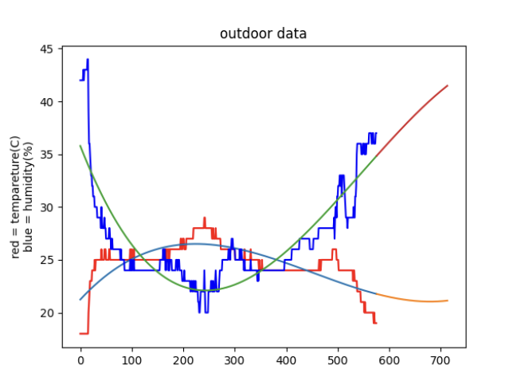

## code
```.py
from matplotlib import pyplot as plt
import requests
import math
import numpy as np


req = requests.get('http://192.168.6.142/readings')
data = req.json()
readings = data["readings"][0]
temp = []
hum = []
count = 0
print('succesful')
for i in readings:
    if i['sensor_id'] == 4:
        hum.append(i)
    if i['sensor_id'] == 5:
        temp.append(i)
#        count +=1

data = {'temp': temp[-576:], 'hum': hum[-576:]}
value = {'temp': [], 'hum': []}

for i in data['temp']:
    value['temp'].append(i['value'])
for i in data['hum']:
    value['hum'].append(i['value'])
print(value)


def mean(a):
    sum = 0
    for i in value[str(a)]:
        sum += i
    mean = round(sum/len(value[str(a)]),1)
    print(f'mean of {a}: {mean}')
    sumdiv = 0
    for i in value[str(a)]:
        sumdiv += (i - mean)**2
    standad_deviation = math.sqrt(sumdiv/len(value[str(a)]))
    print(f'standad deviation of {a}: {round(standad_deviation,2)}')
mean('temp')
mean('hum')

print()

def min(a):
    min = 50
    for i in value[str(a)]:
        if i < min:
            min = i
    print(f'minimum value of {a}: {min}')
min('temp')
min('hum')

def max(a):
    max = 0
    for i in value[str(a)]:
        if i > max:
            max = i
    print(f'maximum value of {a}: {max}')
max('temp')
max('hum')

def median(a):
    median = sorted(value[str(a)])
    print(f'the median of {a}: {median[288]}')
median('temp')
median('hum')


def plot(a):
    z = []
    zy = []
    for i in range(0, len(value[str(a)])):
        z.append(i)
    print(z)
    if a == 'temp':
        c = 'r'
    elif a == 'hum':
        c = 'b'
    plt.plot(value[str(a)],color = c)
    m,b,o,k = np.polyfit(z,value[str(a)], 3)
    for i in range(len(z)):
        zy.append(m*i**3+b*i**2+o*i**1+k)
    plt.plot(zy)
    pre_x = []
    pre_y = []
    for i in range(576,570+12*12):
        pre_x.append(i)
    for i in pre_x:
        pre_y.append(m*i**3+b*i**2+o*i**1+k)
    plt.plot(pre_x,pre_y)
    print(m,b,o,k)


plot('temp')
plot('hum')
plt.ylabel('red = tempareture(C)\nblue = humidity(%)')
plt.title('outdoor data')
plt.show()
```
## result
mean of temp: 24.6

standad deviation of temp: 2.02

mean of hum: 26.7

standad deviation of hum: 4.58


minimum value of temp: 18.0

minimum value of hum: 20.0

maximum value of temp: 29.0

maximum value of hum: 44.0

the median of temp: 25.0

the median of hum: 25.0

the equasion for the graph and prediction:
ax^3 + bx^2 + cx + d

a= 1.1560766498859011e-07 b= -0.0001567440266767569 c= 0.0528467669108278 d= 21.234353936698792

a= -2.0075182536069003e-07 b= 0.00032877661011873274 c= -0.12436927725233127 d= 35.786378839051544

## graph


